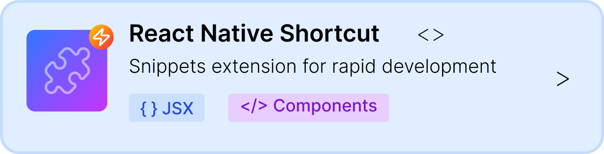
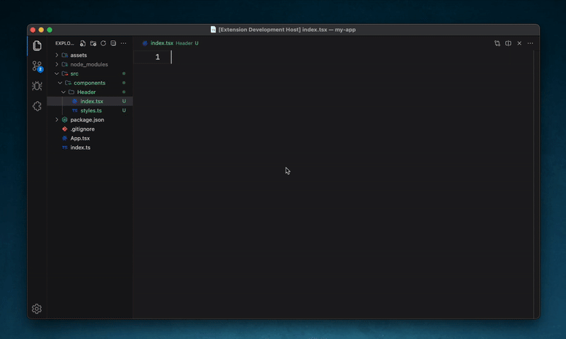
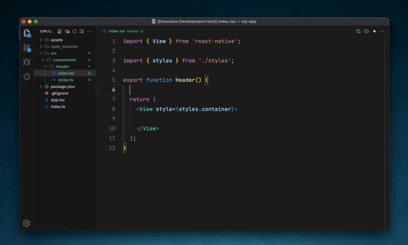

<!--
*** Thank you to see this README.
*** If you have a suggestion that can improve it more than a
*** fork and create a Pull Request or open an Issue with a "suggestion" tag.
*** Thank you a lot!
-->

<h1 align="center">
  
    
</h1>

<h1 style="justify-content: center;  align-items: center; gap: 20px;">
  
  
</h1>
 

## About

This extension makes available a set of Snippets to create components for React Native applications.

### Supported languages (file extensions)

- JavaScript
- TypeScript

## Getting started

Open any file with Visual Studio Code, and type `rn-c` and press `Tab` keyboard to create a new React Native Basic Component.
You can too create a new with Stylesheet to custom our React Native Interfaces typing inside your file `rn-ss` and press `Tab` keyboard to create.

### Snippets

List of available Snippets. Or **⇥** means the `TAB` key.

|    Snippet | Content                                                       |
| ---------: | ------------------------------------------------------------- |
|   `rn-c →` | Create a new **React Native Component**                       |
|  `rn-ss →` | Create a new **React Native Stylesheet Component**            |
|  `rn-sc →` | Create a new **React Native Component with Styled Component** |
| `rn-scs →` | Create a new **Styled Component File**                        |

### Shortcuts

|  Snippet | Content                             |
| -------: | ----------------------------------- |
|   `st →` | Create a new **useState**           |
|   `ef →` | Create a new **useEffect**          |
|   `od →` | Create a new **Object Destructing** |
|   `cl →` | Create a new **Console Log**        |
|   `fn →` | Create a new **Basic Method**       |
| `fn-a →` | Create a new **Basic Method Async** |

## Contribution

Any contribution you make will be **much appreciated**.

#### Find me elsewhere

