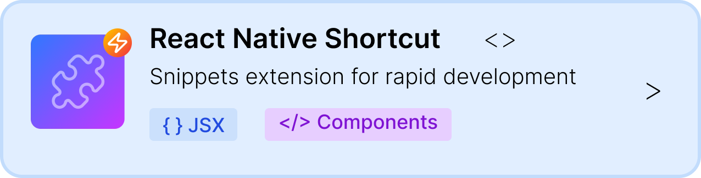
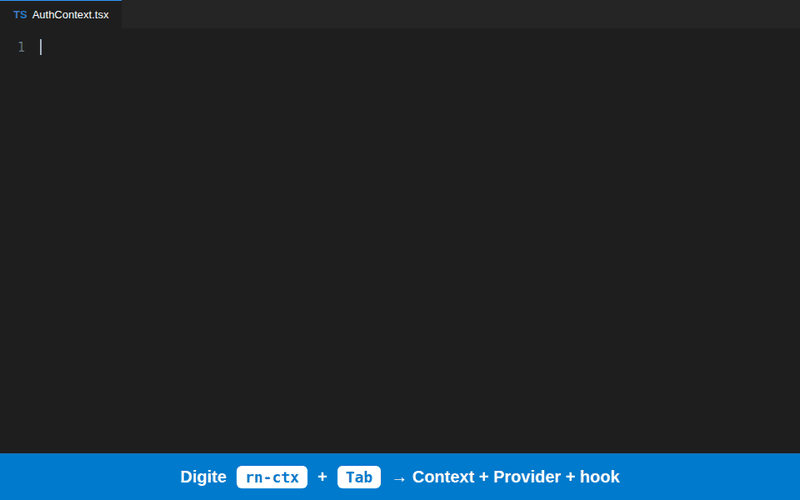
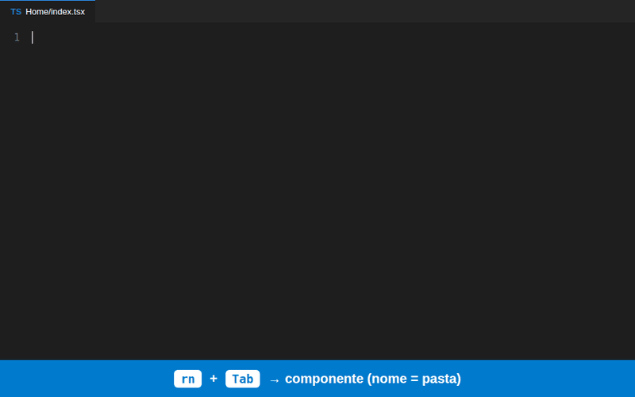
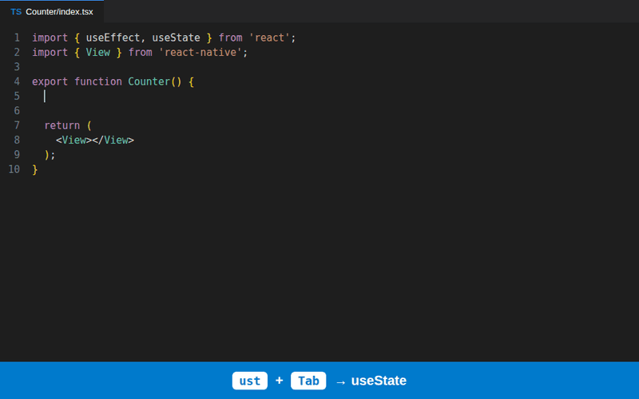

<!--
*** Thank you to see this README.
*** If you have a suggestion that can improve it,
*** fork and create a Pull Request or open an Issue with a "suggestion" tag.
*** Thank you a lot!
-->

<h1 align="center">
  
</h1>

<p align="center">
  <a href="https://marketplace.visualstudio.com/items?itemName=fabianocs.rn-shortcut"></a>
  <a href="https://marketplace.visualstudio.com/items?itemName=fabianocs.rn-shortcut"></a>
  <a href="https://open-vsx.org/extension/fabianocs/rn-shortcut"></a>
</p>

</br>

<p align="center">
  
</p>

<p align="center">
  
</p>

<p align="center">
  
</p>

</br>

## About

Snippets for **React Native** and **Expo** projects: components, StyleSheet, styled-components, hooks, `FlatList` and Context — in JavaScript and TypeScript.

Works in **VS Code**, **Cursor**, **Windsurf** and **VSCodium** (via [Open VSX](https://open-vsx.org/extension/fabianocs/rn-shortcut)).

### Supported languages

- JavaScript (`.js`)
- JavaScript React (`.jsx`)
- TypeScript (`.ts`)
- TypeScript React (`.tsx`)

---

## Getting started

Install **React Native Shortcut** from the VS Code Marketplace, open any `.js`, `.jsx`, `.ts` or `.tsx` file in VS Code, type a snippet prefix and press `Tab`.

Example: type `rn` and press `Tab` to create a basic React Native component.

---

## Snippets

List of available snippets. **⇥** means the `TAB` key.

|       Snippet | Content                                                    |
| ------------: | ---------------------------------------------------------- |
|        `rn →` | Create a **React Native Component**                        |
|      `rn-s →` | Create a **React Native Component** with inline StyleSheet |
|     `rn-si →` | Create a **React Native Component** importing `./styles`   |
|     `rn-sc →` | Create a **React Native Component** with Styled Components |
|  `rn-style →` | Create a **StyleSheet** file (`styles.ts`)                 |
| `rn-styled →` | Create a **Styled Components** file (`styles.ts`)          |
|  `rn-props →` | Create a **React Native Component** with typed `Props`     |
|     `rn-fl →` | Create a **FlatList** with `keyExtractor` and `renderItem` |
|    `rn-ctx →` | Create a **Context** with Provider and `useXxx()` hook     |

---

## Shortcuts

|      Snippet | Content                               |
| -----------: | ------------------------------------- |
|      `ust →` | Create a new **useState**             |
|      `uef →` | Create a new **useEffect**            |
|       `od →` | Create a new **Object Destructuring** |
|       `fn →` | Create a new **Function**             |
| `fn-async →` | Create a new **Async Function**       |
|       `cl →` | Create a new **Console Log**          |

---

## Contribution

To work on the extension locally (requires Node.js 22+):

```bash
npm install
npm run package        # generates the .vsix file
npm run publish        # VS Code Marketplace
npm run publish:ovsx   # Open VSX (Cursor, Windsurf, VSCodium)
```

Press `F5` in VS Code to open a window with the extension loaded.


Any contribution you make will be **much appreciated**.

#### Find me elsewhere

[](https://www.linkedin.com/in/fabianocsouza/)
[](https://github.com/fabianocsouza)

</br>

[](LICENSE)

This project is derived from [rocketseat-vscode-react-native-snippets](https://github.com/Rocketseat/rocketseat-vscode-react-native-snippets), originally created by **Claudio Junior** and published by **Rocketseat** under the MIT license.

Modified by Fabiano C. Souza in 2025 and redistributed under the terms of the MIT license.

See the `LICENSE` file for more details.
